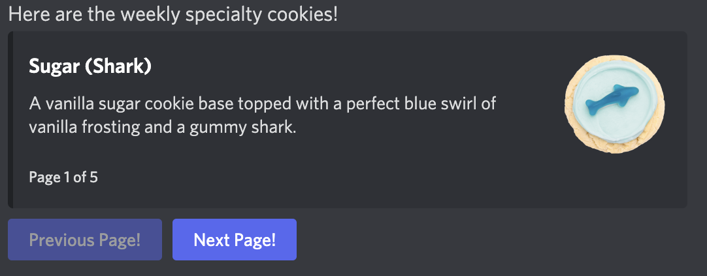
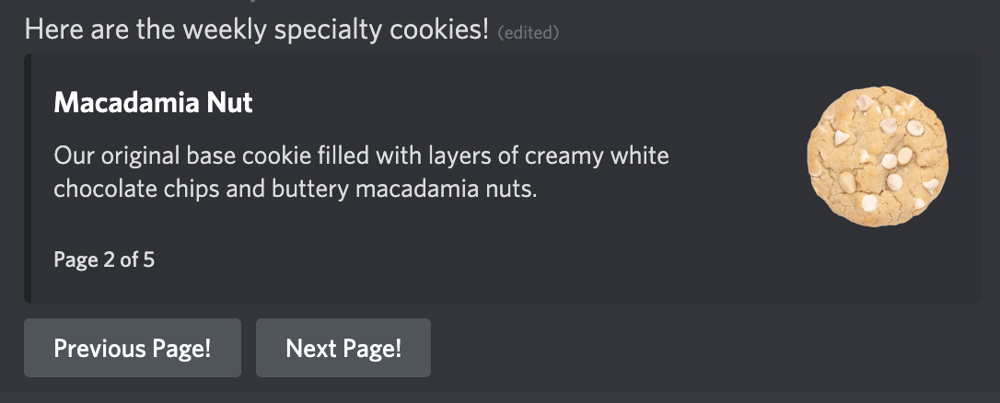

# Discord.js Embed Pagination

An easy and highly customizable utility for paginating embeds in discord.js.



## Features

### Out of bounds button checking.

Buttons become disabled when at the beginning or end of page list:


### Automatic Cleanup

Whenever the given timeout occurs, buttons are automatically removed as well as the current page footer.

## Quick Start

Simply import the and use the utility function:

```ts
import { sendPaginatedEmbeds } from 'discord.js-embed-pagination';

sendPaginatedEmbeds(interaction, embeds);
```

### Example

```ts
import { sendPaginatedEmbeds } from 'discord.js-embed-pagination';

const titles = [
    'Page 1',
    'Page 2',
    'Page 3',
];

async run(interaction: CommandInteraction) {
    const embeds = new titles.map(title => new MessageEmbed.setTitle(title));
    await sendPaginatedEmbeds(interaction, embeds);
}
```

## Customization

You can provide options for how the embed is displayed

```ts
interface PageButtonOptions {
  /**
   * The style of the button.
   */
  style?: InteractionButtonOptions['style'];

  /**
   * The text to be displayed on the next button (Defaults to 'Next').
   */
  nextLabel?: string;

  /**
   * The text to be displayed on the previous button. (Defaults to 'Previous').
   */
  previousLabel?: string;

  /**
   * The message to be alongside the paginated embeds.
   */
  content?: string;

  /**
   * Whether or not to show the current page in the footer of each embed (Defaults to being shown).
   */
  showPagePosition?: boolean;

  /**
   * How long the paginator should run for in ms. (Default is 30min)
   */
  time?: number;

  /**
   * The label that displays in the page position footer.
   */
  pageLabel?: string;
}
```

Like changing the color and label text for example:

```ts
await sendPaginatedEmbeds(interaction, embeds, {
  style: 'SECONDARY',
  previousLabel: 'Previous Page!',
  nextLabel: 'Next Page!',
});
```

This results in something like this:


